# Q1 mining and issuance design recovery

Date: 2026-10-03. Status: research and historical recovery, not a new protocol
specification. Workstream A of the balanced program (separate planning document omitted from this candidate).
No consensus code, monetary issuance, allocation percentage or deployment is
authorized here. The human's priority is to recover existing design before
proposing replacements.

Follow-up, 2026-10-04: the human subsequently authorized the isolated
[mining/delay experiment v0](Q1_MINING_DELAY_EXPERIMENT_V0.md). Its measured
resource and reward-simulation results supplement this historical recovery;
they do not change the approval classification of Mainnet rules below.

## Evidence, scope and classification

Q1 has substantial resource, delay and economic design. It does **not** currently
have a complete approved and implemented mining protocol. These findings are
compatible: a detailed research design is not an executable security mechanism.

The recovery inspected all 204 distinct reachable historical Markdown/text
blobs outside personal collaboration material at this working-tree baseline.
Keyword matches occurred in 175 blobs across 84 paths; none of those paths was
historical-only. Search covered mining, production, delay, HDD/hardware,
proof/evidence, reward, issuance, supply, selection, Sybil, attack cost, fairness,
treasury, founder and emission. Relevant original and amended design sections
were then read against decisions and current code. Keyword hits are an index,
not proof of approval. No other tracked PDF, DOCX, ODT, RST or TeX source was
found. Earlier unwritten discussion, external archives and unreachable/deleted
Git objects are outside this evidence boundary. Do not publish private history
as an attachment to this report.

The earliest available specification checkpoint is 2026-07-24. The delay/HDD
documents were amended at the 2026-07-25 schema checkpoint; the tokenomics draft
remains from the earlier checkpoint. A Git checkpoint date establishes that
text existed then, not that every sentence was approved then.

Classification applies to the stated idea **and scope**:

- **APPROVED**: explicit human/decision authority, with local/private limits
  retained. This does not imply implementation unless separately stated.
- **SUPERSEDED**: an identified later authority replaces the earlier statement
  in a specified scope; the historical text remains historical.
- **EXPERIMENTAL**: a documented candidate, hypothesis, example or recommendation.
- **UNRESOLVED**: a decision needed to define behavior, without a selected rule.

`RESEARCH_REQUIRED`, `UNDER_DISCUSSION` and `OPEN` in the decision register all
map to UNRESOLVED here; the original statuses remain unchanged. Draft MUST/SHALL
wording cannot close a decision. No new ADR or approval is implied.

Primary source key, with section numbers referring to the original headings:

| Key | Source | Recovery focus |
|---|---|---|
| DEC | [Decision register](../../OPEN_DECISIONS.md) | DEC-Q1-004–007, 010, 016–026; LOCALNET authority |
| CON | [Consensus](../05_CONSENSUS.md) | §§9–16, 39–40; candidates, committees, seed, delay relationships |
| DEL | [Delay engine](../06_DELAY_ENGINE.md) | §§3–16, 21–28, 41–43; construction, timing, verification, hardware |
| HDD | [HDD laboratory](../07_HDD_LAB_MODULE.md) | §§1–4, 13–27, 38–44, 61–67; exact experiment and rejection criteria |
| ECO | [Tokenomics](../10_TOKENOMICS.md) | §§3–12, 15–44, 48–54, 67–79, 93; supply, rewards and open parameters |
| GOV | [Governance](../19_GOVERNANCE.md) | §§52–55, 69–70; transparent treasury and founder authority |
| SIM | [Simulation](../15_SIMULATION_PLAN.md) | HDD fraud, Sybil, fairness, concentration, reward variance and pools |
| SEC | [Security](../12_SECURITY_MODEL.md), [attack research](../13_HOW_TO_BREAK_Q1.md) | Hardware, seed, identity and capture threats |
| ROAD | [Historical roadmap](../20_ROADMAP.md) | §§55–56; funding without premature financial issuance |
| LOCAL | [Approved LOCALNET profile](../protocol/Q1_LOCALNET_V0.md) | Exact implemented local behavior, vectors and limits |
| SCHEMA | [Schema checkpoint](../42_DEC_Q1_027_SESSIONS_1_TO_5C_CHECKPOINT_REVIEW.md), [domain registry](../protocol/Q1_CRYPTOGRAPHIC_DOMAIN_REGISTRY_V1.md) | Commitment/schema authority versus unapproved general behavior |

The [earlier issuance thesis](Q1_MAINNET_ISSUANCE_AND_MINING_THESIS.md) remains
the detailed genesis/code-path and founder-funding companion. This recovery
adds the deeper idea inventory and experimental resource reconstruction;
neither document replaces approved specifications.

## Chronology and conflicts

| Evidence date | Recovered intention or decision | Classification and present interpretation |
|---|---|---|
| 2026-07-24, earliest draft checkpoint | Ordered producers execute a sequential delay, optionally consume HDD challenge results, obtain committee attestations and potentially receive rewards | EXPERIMENTAL architecture; exact selection, security construction and rewards not settled |
| 2026-07-24, DEC-Q1-004/006 | Permissioned private registry, equal role weight; explicit genesis allocations sum exactly to declared supply | APPROVED within initial private scope; neither permissionless identity nor a permanent supply cap |
| 2026-07-24, DEC-Q1-016/017 | Integer reward remainder to treasury; private fee burn off, fees to security reward pool | APPROVED initial private rules; not Mainnet shares or a completed reward system |
| 2026-07-24, DEC-Q1-021/022/023 | Fee formula candidate, configurable issuance per finalized block, producer/delay/validator/treasury roles | UNRESOLVED rules with approved constraints; no selected monetary schedule |
| 2026-07-25, schema checkpoint | Header commits to separately encoded delay evidence; chain/role identity and canonical object commitments | APPROVED schema portions; selection and complete compound semantics remained open |
| 2026-10-01–02, human LOCALNET decisions | Fee 1, no issuance/burn/distribution, fixed producer, three voters/quorum 2, NONE delay, full-state commitment | APPROVED and implemented LOCALNET ONLY; scoped exception does not decide Mainnet |
| 2026-10-02, source release and testnet proposal | Public source and reproducible local acceptance; separate public-testnet design proposed | Source release APPROVED/completed; public-network proposal EXPERIMENTAL and unimplemented |
| 2026-10-03, research and balanced program | Recover mining intent; keep technical, network, legal, community and revenue work visible | APPROVED documentation/research scope; economic and public-network choices still UNRESOLVED |

Do not silently reconcile the following differences:

| Earlier text | Later authority / date | Resolution or open conflict |
|---|---|---|
| Genesis allocations may sum to less than declared supply | DEC-Q1-006, 2026-07-24; [normalization report](../25_PHASE_0_1_NORMALIZATION_REPORT.md) | SUPERSEDED: exact equality; any reserve must be explicit. This says nothing about later authorized issuance. |
| Weighted availability/cooldown/contribution lottery in CON | DEC-Q1-004/005, 2026-07-24; later V1 participant schema | EXPERIMENTAL lottery; approved private role weight is 1. Telemetry factors are not approved selection inputs. |
| Delay context includes candidate index, engine and difficulty near header concepts | SCHEMA, 2026-07-25 | SUPERSEDED as a header layout: approved HeaderBody has eleven fields and only the evidence commitment; full engine/difficulty/output/proof live outside it. |
| DEL says DELAY_EVIDENCE has no domain allocation | LOCAL and registry, 2026-10-01–02 | SUPERSEDED: 0x0014 is registered. HDD symbolic domains remain research notation, not new assigned IDs. |
| At least two-thirds versus strictly greater than two-thirds across historical material | Human LOCALNET quorum decision, 2026-10-01 | APPROVED 2-of-3 locally only. General threshold/fault model UNRESOLVED; do not extrapolate Byzantine safety from local availability. |
| Draft discounts/value-sensitive or negative fee ideas | DEC-Q1-021, 2026-07-24 | SUPERSEDED for the initial private candidate: value-sensitive fee zero, no negative fee/anonymous subsidy; full formula remains UNRESOLVED. |
| Draft configurable positive issuance and distributed rewards | LOCAL, 2026-10-01–02 | Replaced only in LOCALNET by zero issuance/distribution; Mainnet options not rejected or approved by that exception. |
| Non-voting producer in local/earlier committee design | Public-testnet proposal, 2026-10-02 | Proposed rotating voting proposer is EXPERIMENTAL, not a superseding decision. A new role/fault decision is required. |

The accepted engineering ADRs settle language, canonical encoding, hashing,
signatures and address encoding. They do not approve mining, an emission
schedule, monetary rewards or a public admission mechanism.

## Recovered idea inventory

Each row classifies a distinct idea or closely related candidates. New proposals
later in this report are explicitly labeled; no percentage is selected.

| Recovered idea | Status | Evidence and boundary |
|---|---|---|
| Sequential effort by a selected producer before proposing | EXPERIMENTAL | DEL §§1–8; intended architecture, not competitive hash-race selection |
| Delay cannot itself select producers, alter balances or finalize | EXPERIMENTAL | DEL §3 / CON §39 draft separation; public binding protocol still unresolved |
| Mock engine and dependent hash-chain laboratory | EXPERIMENTAL | DEL §§5, 8–9; not a reviewed formal VDF |
| Checkpoints, sampled verification and parallel segment verification | EXPERIMENTAL | DEL §10; sampling does not prove all work; full recomputation remains costly |
| Formal VDF with cheap verification | UNRESOLVED | DEC-Q1-025; construction, setup, proof, cost and migration unselected |
| Context-bound challenge and replay/grinding protection | EXPERIMENTAL | DEL §§6–7, 41–43; exact activated public schema and security proof missing |
| Chain-derived common selection seed without producer choice | UNRESOLVED | DEC-Q1-018 / CON §10; hashing finalized inputs alone does not establish unbiased randomness |
| Ordered primary/fallback candidates and temporary committee | UNRESOLVED | DEC-Q1-005/019; exact selection and safe round changes missing |
| Equal-weight genesis private registry | APPROVED | DEC-Q1-004; private permissioning, not Sybil cost |
| Weighted lottery, cooldown, bounded reputation/diversity | EXPERIMENTAL | CON §§11–14; formulas, identity and trusted input problems unresolved |
| Public admission and anti-Sybil resistance | UNRESOLVED | DEC-Q1-024; creating keys must not create free reward/vote weight |
| HDD as available ordinary hardware, latency/storage input | EXPERIMENTAL | HDD §§1–4; accessibility and security-benefit hypotheses |
| Participant-bound deterministic dataset and Merkle root | EXPERIMENTAL | HDD §§13–15; ownership/access does not prove physical disk or unique resource |
| Challenge-selected random read, transform and commitment | EXPERIMENTAL | HDD §§16–25; recommended first workload, not consensus code |
| Sequential/random reads, optional writes, seek/mixed workloads | EXPERIMENTAL | HDD §17; writes require explicit safe opt-in, bounds and wear review |
| Full dataset verification / membership proofs / remote challenge / sampling | EXPERIMENTAL | HDD §§26–27; none proves mechanical latency, location or no RAM substitution |
| HDD telemetry-only, delay-input, reward or eligibility modes | EXPERIMENTAL | CON §40 / HDD; each needs separate activation; telemetry alone grants no reward |
| HDD removal or optional non-consensus use after negative results | EXPERIMENTAL | HDD §§61–65; a valid research outcome, not failure to follow the original thesis |
| Useful storage/archive service rather than artificial workload | UNRESOLVED | HDD §44/66; no implemented useful-storage proof or reward claim |
| Hardware fairness / bounded influence / no unlimited wealth control | EXPERIMENTAL | CON, DEL §22, HDD §42, SIM; objectives, not proven properties |
| Sequential versus staggered/parallel fallback delay execution | EXPERIMENTAL | DEL §23; liveness, latency and wasted-work tradeoff |
| Hardware dominance responses and difficulty/window adaptation | EXPERIMENTAL | DEL §§24–25; no authority for telemetry or AI to change live consensus |
| Exact genesis allocation sum including reserves | APPROVED | DEC-Q1-006; implemented locally; not a choice of lifetime supply |
| Test Q1T denomination and faucet/genesis configuration | EXPERIMENTAL | ECO §§3, 9–10; no Mainnet denomination or entitlement |
| Fixed maximum, continuing bounded emissions, adaptive issuance | EXPERIMENTAL | ECO §10; alternatives, not a selected winner |
| Configurable fixed issuance per finalized block | UNRESOLVED | DEC-Q1-022; approved test-only constraints, amount/activation open |
| Historical 10 Q1T/block, 35/25/30/10 split, 10-block maturity examples | EXPERIMENTAL | ECO §§11, 31, 42; historical illustrations only, not approvals or current recommendations |
| Fees plus issuance form a deterministic reward budget | EXPERIMENTAL | ECO §§13, 29, 74–79; actual settlement semantics still required |
| Producer, delay executor, eligible validator and treasury recipients | UNRESOLVED | DEC-Q1-023; weights, duplicate roles, maturity and penalties not settled |
| No issuance for AI output or HDD telemetry alone | APPROVED | DEC-Q1-022 explicit test-only constraints; not permission for other monetary issuance |
| HDD, AI and relay reward shares default to zero in initial planning | EXPERIMENTAL | DEC-Q1-023 background / ECO; full allocation rule remains open |
| Private integer remainder to treasury and no fee burn | APPROVED | DEC-Q1-016/017; does not approve the rest of the reward algorithm |
| Burn, fee reserve and long-term fee-only security | UNRESOLVED | ECO §§28, 53, 93; Mainnet purpose, rules and adequacy not selected |
| Virtual penalties; later monetary stake/slashing | EXPERIMENTAL | ECO §44; neither real collateral nor enforceable attack-cost budget exists |
| Transparent genesis development reserve/founder allocation/vesting | UNRESOLVED | ECO §9, GOV; no selected founder quantity, percentage, beneficiary schedule or vesting implementation |
| Treasury multisignature, reporting, conflicts and founder-power sunset | EXPERIMENTAL | GOV §§52–55, 69–70; recommended structure is not activated governance |
| Services/grants before premature token funding | EXPERIMENTAL | ROAD §§55–56; current human program authorizes preparation, not receipts or offers |
| Pool formation, reward variance, Gini/operator concentration studies | EXPERIMENTAL | ECO §§67–69 / SIM; measurements/scenarios specified, results not established |
| LOCALNET fixed producer, 2-of-3 votes, fee pool and NONE witness | APPROVED | LOCAL; implemented test behavior, not mining |

## Intended resource and evidence mechanism

### Delay pipeline reconstructed from DEL / CON

The intended producer is selected **before** executing its delay task. This is
not evidence of an implemented open race where the most resource wins a block.
The conceptual context binds chain, height, round, producer/candidate, finalized
parent and certificate, seed, engine/version, difficulty and parameters.
Optional HDD input would have to be bound to that same fresh context.

```mermaid
flowchart LR
    F[Finalized context and participant set] --> S[Unresolved deterministic selection]
    S --> C[Context-bound delay challenge]
    C --> D[Candidate delay engine]
    C -. optional research .-> H[HDD challenge and commitment]
    H -. separately approved composition .-> D
    D --> E[Output and proof evidence]
    E --> V[Independent evidence and state verification]
    V --> Q[Signed committee protocol]
    Q --> Z[Finalization]
    Z -. unresolved economic policy .-> R[Reward settlement]
```



For the sequential-hash candidate, each step depends on the previous result:
`x0 = H(challenge)`, `xi = H(challenge, i, x(i-1))`, for a configured number of
iterations. This represents hash computation and elapsed execution on some
hardware, not a trusted measurement of universal seconds, energy or money.
Recomputing every step verifies the result but costs comparable hash work.
Checkpoints do not automatically create succinct sound verification. The
formal-VDF goal is documented; no reviewed construction or demonstrated
verification/work ratio has been selected.

Proposed context checks prevent accepting mismatched chain/height/round/parent,
producer, parameters or engine. They do not by themselves rule out algebraic
shortcuts, faster specialized hardware, outsourcing, seed grinding or early
knowledge of future challenges. Those need construction-specific attack tests
and cryptographic review. Verifier caching must include the full context.

### HDD pipeline reconstructed from HDD §§13–27

The laboratory design is concrete enough to recover without inventing a new
storage protocol:

1. Generate participant-bound deterministic chunks from a seed and index;
   commit to a dataset root, size, chunk count and version. Dataset sizes and
   sample counts in the draft are experimental parameters, not approved minima.
2. Derive `HDDChallenge` from the delay challenge, participant, dataset identity,
   workload version and parameter commitment.
3. For sample `j`, hash the challenge and `j` to select `chunk_index mod C`.
4. Read the selected chunk; hash the challenge, sample index, chunk index and
   bytes into a response. Commit to all responses with a Merkle root.
5. Supply the selected data/indices/paths or another explicitly chosen proof
   form. Verify dataset membership, selection, response hashes and commitment.

`RANDOM_READ_TRANSFORM_COMMIT_V1` is the recommended first **experimental**
workload. Its symbolic hash domains and Merkle profile still need exact approved
encodings before consensus use. This report does not register new domains.
Duplicate selection, workload sizes, proof bounds and dataset lifecycle also
need a selected profile.

The original rationale is that ordinary disks are available and seek/storage
behavior might add an accessible resource cost. What membership proofs actually
show is consistency with committed data and a challenge response. They do not
show that bytes came from rotating media, were stored continuously, were held
locally, could not be regenerated, were unavailable in RAM/SSD, or belonged to
one economic operator. Because data are deterministic, recomputation/time-memory
tradeoffs must be measured as well as cache and outsourcing attacks. Multiple
participant IDs do not establish multiple physical devices.

Independent verification can check cryptographic data relationships, signatures,
canonical bytes and an approved computation. Device type, physical read time,
energy and ownership remain telemetry, not consensus truth. Remote challenges
may test timely access but introduce network and measurement assumptions.
Sampled checking establishes only its specified probabilistic assurance.

### Effects on eligibility, ordering, finality and reward

| Layer | Historical intention | Current implementation / missing authority |
|---|---|---|
| Eligibility | Registry and selection choose candidate; HDD modifier only as separately enabled experiment | Fixed local roles; public admission, identity cost and contribution weight unresolved |
| Ordering | Ordered candidates and execution windows; seed may include prior delay output | No local rotation; seed bias, windows and safe fallback unresolved |
| Validity | Configured delay proof required alongside transaction/state validity | Only exact NONE witness accepted on Localnet |
| Finality | Committee certificate, not delay output alone | Local 2-of-3 certificate implemented; public locking/fault model still needs approval |
| Reward | Finalized valid production/delay/attestation may earn a share | No local payouts; Mainnet evidence eligibility, shares and settlement unresolved |

### Specialized hardware, attack cost and concentration

Q1 has no established monetary attack-cost bound. A permissioned registry limits
identities administratively; this is not proof that an attacker must buy a scarce
resource. Sequential dependence can limit some parallelism without eliminating
GPU/FPGA/ASIC advantage. HDD proofs do not establish an unavoidable disk cost.

The drafts explicitly call for consumer/server/specialized hardware comparisons,
HDD versus SSD/RAM/remote emulation, cache controls, energy/wear, verifier cost,
reward variance, pool incentives and operator concentration. Faster operators
may dominate deadlines, selection outcomes or reward collection. Weight per
identity can worsen this through Sybil splitting; per-device caps require a
credible device/identity mechanism that is currently absent.

EXPERIMENTAL next research package: freeze a workload and threat hypothesis,
record raw measurements on available equipment, compare the cheapest known
emulation with honest execution, and report uncertainty and concentration.
Measurements unavailable on existing equipment stay missing; do not buy hardware
or claim ASIC resistance to fill that gap. Predetermine retain/restrict/remove
criteria for HDD as in HDD §§61–65. Removing an ineffective module is an allowed
research outcome. No live adaptive response or claimed low-energy benefit is
approved by this analysis.

## What exists today, and why it is not mining

[`LocalnetNoneEvidence`](../../crates/q1-protocol-types/src/delay.rs) encodes
exactly `[1, 0, 0, h'', h'']` (`850100004040`) and commits under
`DELAY_EVIDENCE = 0x0014`. Construction, decoding and verification reject every
network class except Localnet. The repeated witness carries no performed work,
fresh challenge, hardware contribution or monetary reward. The signed proposal
binds local block context; that does not turn the empty witness into work proof.

[`Genesis`](../../crates/q1-localnet/src/genesis.rs) validates explicit test
allocations; [`Ledger`](../../crates/q1-localnet/src/ledger.rs) initializes those
balances, charges one base unit only for successful transfers and conserves
balances plus the pool. [`StateSnapshot`](../../crates/q1-localnet/src/state.rs)
binds supply to genesis. [`Chain`](../../crates/q1-localnet/src/block.rs) verifies
fixed-role signed proposals/certificates and deterministic transitions; storage
replays those transitions. No engine issues coins for resource evidence.

LOCALNET balances are test state, not Mainnet Q1; they have no monetary claim.
The acceptance fixture's 1000 units do not determine Mainnet supply. Its final
956 sender + 40 recipient + 4 pool = 1000 is conservation evidence, not emissions.

| Missing component of an actual mining protocol | Decision/evidence required |
|---|---|
| Scarce resource and measurable contribution | Identify what an attacker cannot cheaply duplicate, simulate or outsource away; define units and cost model |
| Work/evidence construction | Exact challenge, engine, proof, canonical schemas, bounds and review; DEC-Q1-010/025 |
| Independent verification | Soundness, replay/shortcut resistance and affordable verification; adversarial vectors and independent review |
| Miner eligibility and Sybil resistance | Admission, identity splitting and contribution weight; DEC-Q1-024/005 |
| Producer/validator selection | Unbiased-enough seed under stated threat model, algorithms, committee roles; DEC-Q1-018/005 |
| Safe finalization and fault recovery | Quorum, durable locking, round change and conflicting-certificate handling; DEC-Q1-019/020 |
| Earned reward and issuance | Trigger, eligible recipients, supply schedule, duplicate roles, rounding and maturity; DEC-Q1-021/022/023 |
| Attack cost and fairness | Measured hardware advantage, resource substitution, pools/concentration and sensitivity analysis |
| Executable state and assurance | New economic state, atomic settlement, replay/sync, full vectors and network tests |

There is no basis to label the implemented LOCALNET as Proof-of-Work or to
advertise miners earning Q1. Whether a future resource mechanism deserves a
specific mining/security label depends on its completed definition and evidence.

## Mainnet issuance options — comparison, no selection

These are analytical alternatives, not three already approved Q1 modes. The
historical draft's test-faucet model may itself allow later issuance; it must not
be mislabeled as fixed lifetime genesis supply.

| Criterion | Fixed genesis supply | Progressive earned issuance | Hybrid genesis + earned issuance |
|---|---|---|---|
| Security funding | Fees or a finite prefunded reserve; demonstrate sustainability after reserve depletion | Newly created rewards can fund participation; no guarantee units cover real costs | Early reserve plus later rewards; both budgets and their interaction need evidence |
| Miner/validator incentive | Fees/reserve payouts need eligible-work rules even with no minting | Defined work/validation can earn emissions after finality; cheap fake participation must not earn them | Same eligibility problem plus fair treatment of early recipients |
| Decentralization | Initial allocation can concentrate control; fixed supply does not solve admission | Broader earning possible, but hardware, identity and early-adopter concentration remain | Can distribute roles over time but preserve genesis influence |
| Founder/project funding | Disclosed allocation or funded fees; units are not cash | Project nodes may earn under equal rules; treasury stream needs authority | Development reserve plus earned/treasury flow; avoid duplicate privileged funding |
| Near-zero-capital bootstrap | Allocation requires little computation but does not pay real bills | Existing hardware can test a candidate; operators still bear energy/time costs | Lab genesis and resource experiments feasible without sale; reviews/operations still cost |
| Supply predictability | Cap explicit if future minting prohibited; burn may reduce outstanding supply | Predictable only with approved schedule/trigger/cap or perpetual policy | Must disclose both genesis amount and complete future schedule |
| Inflation | No new units; reserve releases can increase liquid float | New units dilute prior shares; distinguish per-block schedule from uncertain calendar issuance | Same dilution plus unlock/release effects |
| Concentration | Premine/reserve custody and founder capture risk | Hardware advantage, pool formation, Sybil farming and reward compounding | Combines both sets of risks |
| Fairness | Transparent allocations and vesting do not prove fair access | Access, measurable work, deadlines, verifier burden and reward variance need tests | Early-versus-late participant and genesis-versus-earned treatment must be explicit |
| Delay/resource fit | Delay can validate eligibility/work without minting; fee-funded incentives still needed | Closest to historical role-reward hypothesis, but missing resource proof cannot be supplied by emissions | Supports experiments in both allocation and work rewards, with more state complexity |
| Long-term operation | Demonstrate fees/reserve can fund security across low-use periods | Continued issuance or transition to fees must have a justified security budget | Reserve expiry, emission changes and fee transition all need scenario analysis |

No model wins solely because it can create balances cheaply. No Mainnet supply,
rate, cap, percentage, vesting duration or founder entitlement is selected.

## Reward and treasury flow

Implemented local flow for a valid transfer of amount A:

```text
sender:        -(A + 1)
recipient:     +A
reward_pool:   +1
new issuance:   0
burn:           0
distribution:   0
```

FeeLimit is only a cap; a cap below 1 rejects. Invalid/rejected transactions and
failed blocks cause no partial state or fee changes. The pool is committed test
state, not a project bank account or founder payout.

EXPERIMENTAL future accounting map, to make missing decisions visible:

```text
explicit genesis allocation -> accounts / disclosed treasury / founder vesting / reserve
authorized new issuance ----\
collected transaction fees ---+-> specified economic settlement
                              -> eligible producer / delay executor / validators
                              -> authorized development treasury / reserve
                              -> burn only under a separately approved rule
```

| Flow | LOCALNET | Mainnet authority still needed |
|---|---|---|
| Genesis balances | Explicit allocation sum equals declared test supply | Amount, recipients, purpose, distribution and governance |
| Fees | Actual 1 to pool; conserved supply | Formula, limits, congestion, reward routing |
| New issuance | Zero | Creation reason, event, schedule and authorized recipients |
| Miner/validator payout | None | Work/attestation eligibility, duplicate roles, weights, maturity and penalties |
| Development treasury | No payout; pool is not treasury cash | Source, address, controls, reporting, spending authority |
| Founder allocation | No special founder entitlement | Transparent allocation or equal-rule earned rewards; vesting/enforcement |
| Burn | Zero | Purpose, formula and conservation accounting |
| Reserve | No implicit unallocated supply | Explicit funded allocation, release rules and custody |

For any proposed transition, separately account for minting and burning:
`supply_after = supply_before + authorized_issuance - authorized_burn`.
Transfers into rewards/treasury/reserve are movements, not additional supply.
Avoid counting the same fee or allocation twice. Draft “circulating” totals that
include locked protocol balances should not be advertised as liquid float.

Two implementation dependencies prevent simply adding a reward constant:

- The current proposal commits StateRoot before votes arrive. Paying its own
  actual certificate signers could make two valid signer subsets produce
  different roots. Recipient-set commitment or later settlement needs an
  explicit decision; neither is selected here.
- A reward record containing its own block's final hash inside that block's
  state would introduce a self-reference. Record identity/settlement timing must
  avoid that cycle. Supply checks, snapshots, replay and independent vectors
  must all evolve under an approved new profile, not weakened local guards.

No approved founder allotment or automatic founder entitlement was recovered.
Founder funding remains a choice among disclosed genesis allocation/vesting,
authorized treasury flow, equal-rule node rewards and ordinary services. Only
received service/sponsorship cash can fund current bills without assuming a
monetary distribution. Tokens held, test pools and expected future proceeds are
not cash revenue. No external capital is needed to write these rules; secure
operation, paid review and hardware/time cannot be assumed free.

## Next evidence and decisions

Proposed A1 deliverable: a decision package with exact threat/resource hypothesis,
candidate engine comparison, HDD retain/restrict/remove criteria, selection/Sybil
dependencies and alternative settlement sequences. Begin with measurements
possible on existing hardware; label unavailable measurements and unreviewed
cryptography. No monetary outputs and no production-code activation.

Proceed alongside the [testnet milestone](Q1_PUBLIC_TESTNET_V0_PLAN.md),
international legal review (separate planning document omitted from this candidate),
factual community plan (separate planning document omitted from this candidate) and
service-revenue ladder (separate planning document omitted from this candidate).
Missing mining decisions must not silently erase those four streams; legal
research and public attention must not be represented as engineering completion.

Required human decisions remain: intended scarce resource/security claim and
permitted experiment; public-testnet roles/fault/delay profile; selection/admission
and seed; issuance model/schedule; reward settlement/recipients; treasury/founder
controls; and the separate jurisdiction-specific monetary-distribution gate.
Approving this recovery as accurate would not approve any of those parameters.

## Verification of this documentation checkpoint

`python3 scripts/check_documentation.py` passed with zero broken Markdown links
and zero blocking failures. It still reports 29 missing-reference advisories,
10 legacy-path mentions and 179 flagged lines across historical/planning
documents. These advisories are not evidence that those future components exist.
`git diff --check` passed. Changes are confined to nine Markdown files; no runtime,
consensus, license, release asset or protocol-vector changes were made. No new
Rust/full-suite run, remote CI, hardware benchmark or PTN0 acceptance is claimed.
